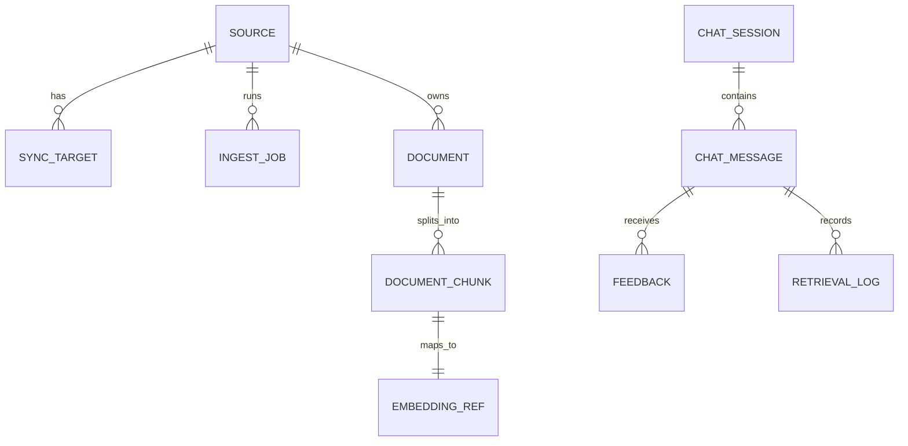

# Data Model & API Requirements

## 1. 데이터 저장 역할
- MySQL: 시스템 오브 레코드(소스/타겟/문서 메타/원문 chunk/잡/세션/피드백/로그)
- Qdrant: chunk embedding 벡터 + 검색 필터용 payload
- Redis: BullMQ backend + 캐시

## 2. 엔티티(개념 모델)
- Source
- SyncTarget
- Document
- DocumentChunk
- EmbeddingRef
- IngestJob
- ChatSession / ChatMessage
- Feedback
- RetrievalLog

## 3. ERD (Mermaid)


## 4. API (MVP)
### 공통
- Auth: `Authorization: Bearer <APP_TOKEN>` (MVP 단일 토큰)
- JSON only

### 4.1 Source/Target
#### POST /sources/notion
Request
```json
{
  "name": "my-notion",
  "notionIntegrationToken": "secret_xxx",
  "notionApiVersion": "2025-09-03"
}
```
Response (201)
```json
{ "sourceId": 1 }
```

#### POST /sources/:sourceId/targets
Request
```json
{ "targetType": "data_source", "targetId": "xxxxxxxx-xxxx-...." }
```
Response
```json
{ "targetId": 10 }
```

#### GET /sources/:sourceId/targets
Response
```json
{
  "targets": [
    { "targetId": 10, "targetType": "data_source", "targetIdValue": "....", "status": "active" }
  ]
}
```

### 4.2 Ingest
#### POST /ingest/run
Request
```json
{ "sourceId": 1, "mode": "full" }
```
Response
```json
{ "jobId": 1001, "queued": true }
```

#### GET /ingest/jobs?sourceId=1
Response
```json
{
  "jobs": [
    { "jobId": 1001, "type": "full", "status": "running", "startedAt": "2026-02-26T12:00:00Z" }
  ]
}
```

#### POST /notion/webhook (P1)
- 200 OK 즉시 응답 후 내부 enqueue

### 4.3 Chat
#### POST /chat
Request
```json
{
  "sourceId": 1,
  "sessionId": 501,
  "message": "프로덕션 배포 체크리스트 알려줘"
}
```
Response
```json
{
  "sessionId": 501,
  "answer": "....",
  "citations": [
    {
      "chunkId": 9001,
      "title": "배포 가이드",
      "url": "https://www.notion.so/....",
      "quote": "1) 배포 전 ..."
    }
  ],
  "meta": { "topK": 8, "retrievalMs": 120, "llmMs": 2100 }
}
```

### 4.4 Feedback
#### POST /feedback
Request
```json
{ "messageId": 777, "score": 1, "reason": "근거가 명확함" }
```
Response
```json
{ "ok": true }
```
